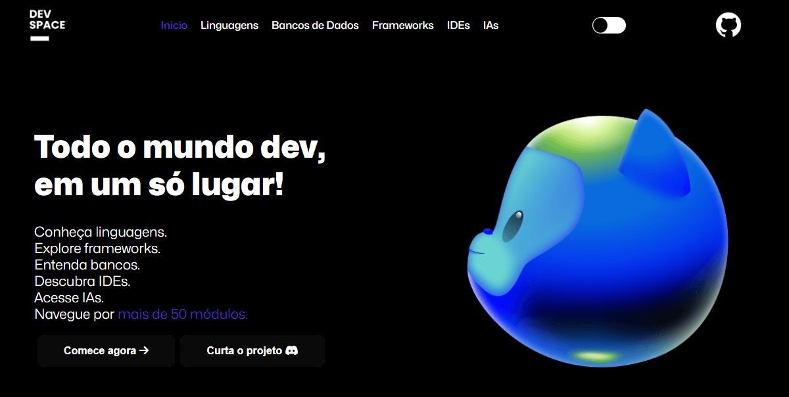

# 🌌 DEVSPACE

**DEVSPACE** é uma plataforma que reúne as principais ferramentas do mundo do desenvolvimento. Navegue por **linguagens de programação**, **bancos de dados**, **frameworks**, **IDEs**, e **inteligências artificiais** em um ambiente com visual **simples, agradável e intuitivo**.



## Funcionalidades

- **Linguagens de Programação**: Explore as linguagens mais populares, suas características, e como elas podem ser utilizadas.
- **Bancos de Dados**: Encontre informações sobre os bancos de dados mais utilizados, desde SQL até NoSQL.
- **Frameworks**: Descubra os frameworks mais poderosos para acelerar o desenvolvimento de suas aplicações.
- **IDEs**: Confira as principais ferramentas de desenvolvimento e escolha a que mais combina com você.
- **IAs**: Explore soluções de inteligência artificial que podem melhorar seu fluxo de trabalho no mundo dev.

## Tecnologias Utilizadas

- **HTML 5** 
- **CSS**
- **JavaScript**

## Design

A interface do **DEVSPACE** foi projetada para ser **minimalista** e **intuitiva**, garantindo uma navegação fluida e prazerosa. O design é responsivo, proporcionando uma ótima experiência tanto em desktops quanto em dispositivos móveis.

## Como Rodar o Projeto

1. Clone este repositório:

   ```bash
   git clone https://github.com/seu-usuario/devspace.git
   ```

2. Navegue até o diretório do projeto:

   ```bash
   cd diretório/do/projeto
   ```

3. Acesse no seu navegador:
   ```bash
   http://localhost:3000
   ```

## Contribuição

Contribuições são bem-vindas! Siga os passos abaixo para contribuir com o DEVSPACE:

1. Faça um fork deste repositório.

2. Crie uma nova branch com sua feature ou correção de bug:

```bash
 git checkout -b minha-feature
```

3. Faça o commit das suas mudanças:

```bash
 git commit -m 'Adiciona nova feature'
```

4. Envie suas alterações:

```bash
 git push origin minha-feature
```

5. Envie suas alterações.
