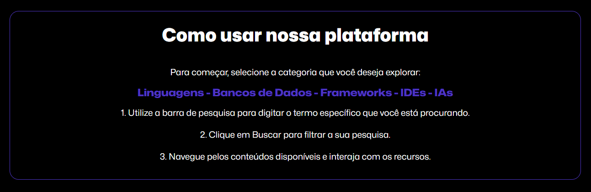

# [🌌 DEVSPACE](https://devspaceee.vercel.app)

**DEVSPACE** é uma plataforma que reúne as principais ferramentas do mundo do desenvolvimento. Navegue por **linguagens de programação**, **bancos de dados**, **frameworks**, **ambientes de desenvolvimento**, e **inteligências artificiais** em um ambiente com visual **simples, agradável e intuitivo**.


## Como usar

Para começar a utilizar o **DEVSPACE**, siga as etapas descritas na imagem abaixo. Ela fornece um guia visual sobre como explorar e aproveitar ao máximo a plataforma.



## Funcionalidades

O **DEVSPACE** oferece uma funcionalidade principal: explorar ferramentas de desenvolvimento por meio de módulos organizados. Você pode acessar e descobrir informações detalhadas sobre:

- **Linguagens de Programação**: Conheça as linguagens mais populares e suas características.
- **Bancos de Dados**: Encontre informações sobre diversos tipos de bancos de dados, desde SQL até NoSQL.
- **Frameworks**: Descubra frameworks que podem acelerar o desenvolvimento de suas aplicações.
- **IDEs**: Explore as principais ferramentas de desenvolvimento e encontre a que melhor se adapta às suas necessidades.
- **IAs**: Conheça soluções de inteligência artificial que podem aprimorar seu fluxo de trabalho no mundo dev.

### Responsividade

O **DEVSPACE** foi projetado para ser totalmente responsivo, oferecendo uma excelente experiência de navegação em desktops, tablets e dispositivos móveis. A interface se ajusta automaticamente ao tamanho da tela, garantindo que você possa explorar as ferramentas de forma confortável em qualquer dispositivo.

### Tema Claro e Escuro

Para se adequar às suas preferências visuais e condições de iluminação, o **DEVSPACE** oferece suporte a temas claro e escuro. Você pode alternar entre os modos de visualização para uma experiência personalizada e agradável.

## Tecnologias Utilizadas

O **DEVSPACE** foi desenvolvido utilizando as seguintes tecnologias:

- **HTML5**: Utilizado para estruturar o conteúdo da plataforma, garantindo uma base sólida e semântica para o desenvolvimento.
- **CSS**: Empregado para estilizar e criar um design responsivo e agradável, proporcionando uma experiência de usuário intuitiva e visualmente atraente.
- **JavaScript**: Implementado para adicionar interatividade e dinamismo à plataforma. Além de permitir a alternância entre temas claro e escuro, o JavaScript é utilizado para realizar buscas eficientes e apresentar os resultados de maneira organizada e intuitiva, facilitando a exploração das linguagens de programação, bancos de dados, frameworks, IDEs e IAs.

Essas tecnologias foram escolhidas para garantir um desenvolvimento eficaz e uma experiência de usuário de alta qualidade.

## Como Rodar o Projeto

1. Clone este repositório:

   ```bash
   git clone https://github.com/seu-usuario/devspace.git
   ```

2. Navegue até o diretório do projeto:

   ```bash
   cd diretório/do/projeto
   ```

3. Acesse no seu navegador:
   ```bash
   http://localhost:3000
   ```

## Contribuição

Contribuições são bem-vindas! Siga os passos abaixo para contribuir com o DEVSPACE:

1. Faça um fork deste repositório.

2. Crie uma nova branch com sua feature ou correção de bug:

```bash
 git checkout -b minha-feature
```

3. Faça o commit das suas mudanças:

```bash
 git commit -m 'Adiciona nova feature'
```

4. Envie suas alterações:

```bash
 git push origin minha-feature
```

5. Envie suas alterações.

Nasceu durante a imaeresaod

## Processo de Criação

O **DEVSPACE** nasceu da minha vontade de entender melhor o mundo do desenvolvimento e explorar as ferramentas mais importantes na área. O design foi inspirado na antiga página inicial do GitHub, que oferecia uma visão clara e acessível das da plataforma, decidi criar uma similar, mas com um foco diferente.

### Motivação

Como alguém que não tinha um conhecimento profundo sobre várias ferramentas do mundo dev, eu buscava uma maneira prática e eficaz de aprender e conhecer novas tecnologias. O **DEVSPACE** foi desenvolvido para preencher essa lacuna, proporcionando um espaço onde posso explorar linguagens de programação, bancos de dados, frameworks, IDEs e inteligências artificiais de forma organizada e intuitiva.

### Desenvolvimento

Foram dedicadas mais de 20 horas ao aprendizado e aplicação de **HTML**, **CSS** e **JavaScript** no desenvolvimento do **DEVSPACE**. O projeto foi construído com um design **minimalista e intuitivo** para garantir uma navegação fluida e agradável. Utilizando essas tecnologias, foi criada uma interface que é ao mesmo tempo simples e eficiente, proporcionando uma experiência de exploração das ferramentas que é a mais agradável possível.

Além disso, foram exploradas e implementadas animações e efeitos de **CSS**, que adicionaram um toque especial e dinâmico à plataforma. Essas adições não só melhoraram a estética do projeto, mas também enriqueceram a experiência do usuário com interações mais envolventes e visuais.

### Objetivo

O objetivo do **DEVSPACE** é servir como uma ferramenta de aprendizado e referência para desenvolvedores de todos os níveis, oferecendo uma visão clara e acessível das principais tecnologias disponíveis no mercado. Espero que o **DEVSPACE** ajude não apenas a mim, mas também a outros desenvolvedores a expandirem seu conhecimento e se familiarizarem com novas ferramentas e tecnologias.

### Agradecimentos

Gostaria de agradecer a todos os desenvolvedores e projetos que inspiraram este trabalho, bem como à comunidade que torna o aprendizado e a inovação possíveis. Sem o apoio e os recursos disponíveis, este projeto não seria possível.
